# Mobile_Article_App

## Important Backend Web API
1) To View the Backend Web API, please go to this link => (https://github.com/Kelvin229/Mobile_Article_WebAPI_Django)

## Description
Mobile Article App is a note-taking and article posting mobile application that allows users to document personal information or any other information. With this app, users can easily take and manage notes on their mobile device.

## Features of the app
The app currently allows users to create, edit, and delete notes. However, I'm constantly improving and adding new features, such as authentication and authorization, video saving, a chatting system between users, and search and filtration for notes.

## Technology Stack
The Mobile Article App is built using React Native for the user interface, Expo for package management and running the application, Django for the web API, and SQLite for database management.

## Screenshots and Demos
Check out some screenshots and a demo of the app in action:

  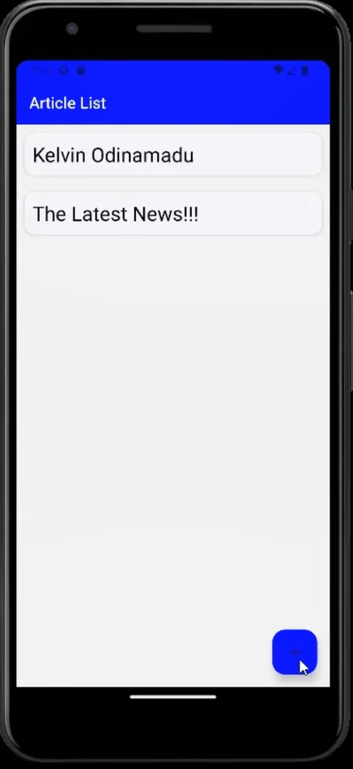
  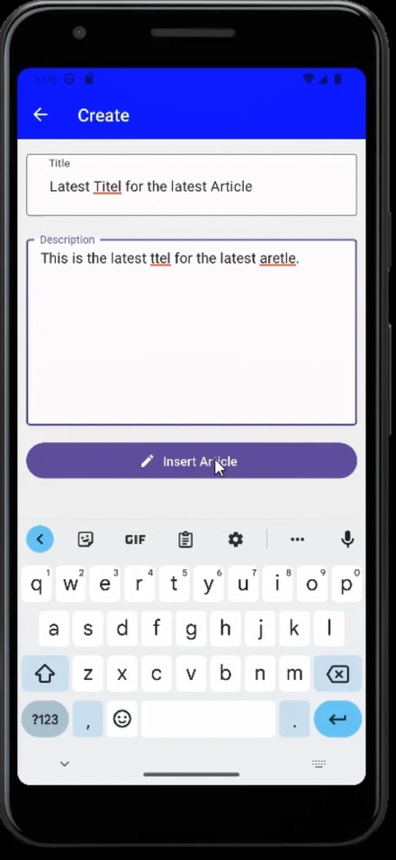

  
  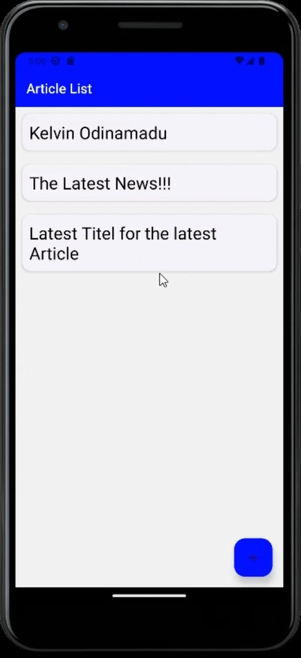

  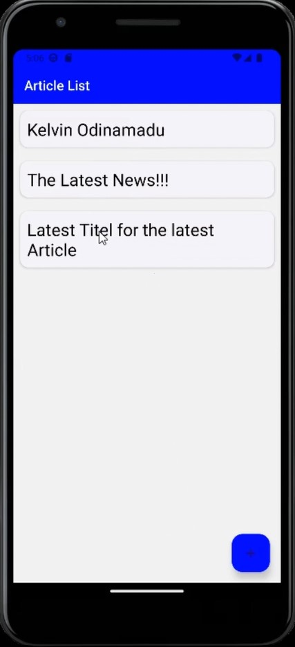
  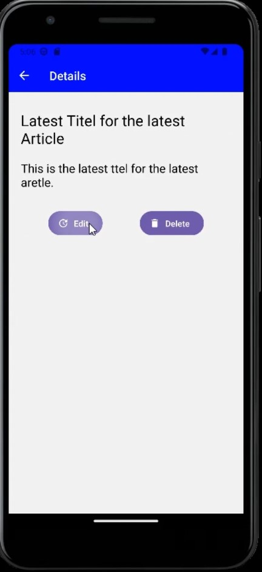

  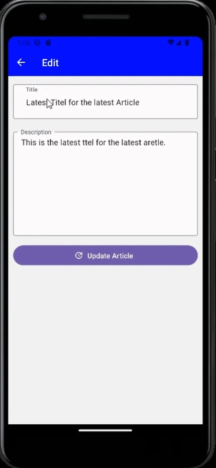
  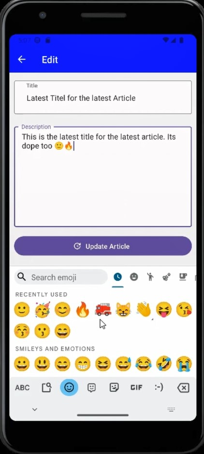

  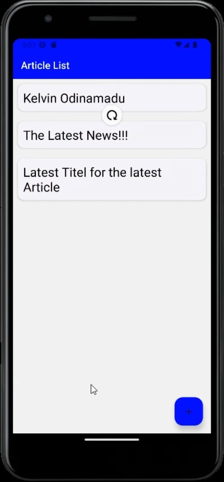
  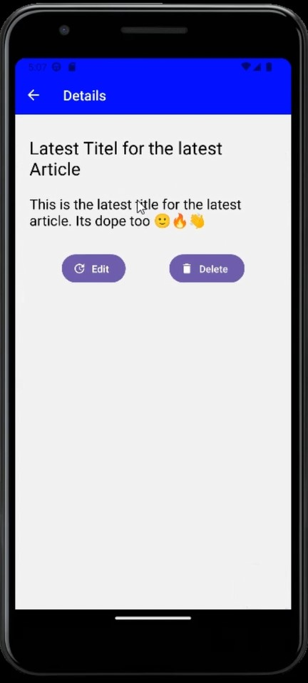

  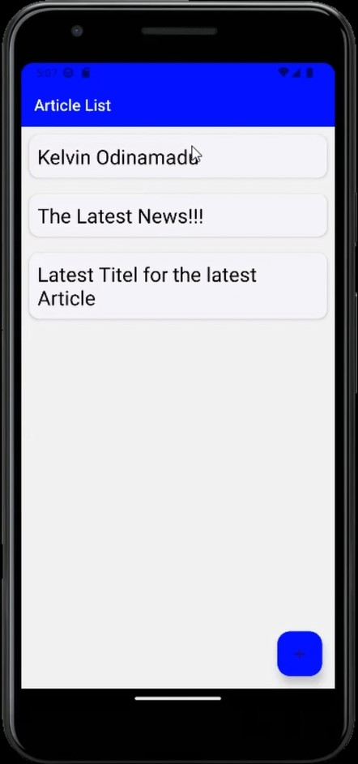
  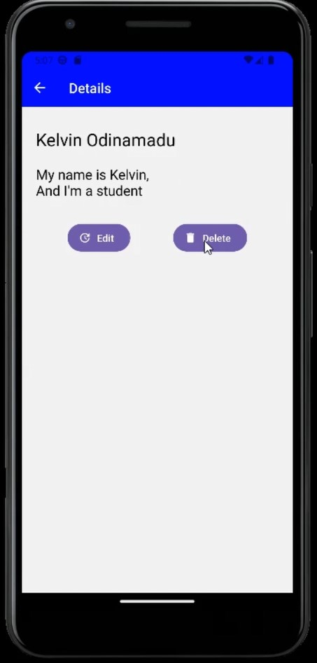

  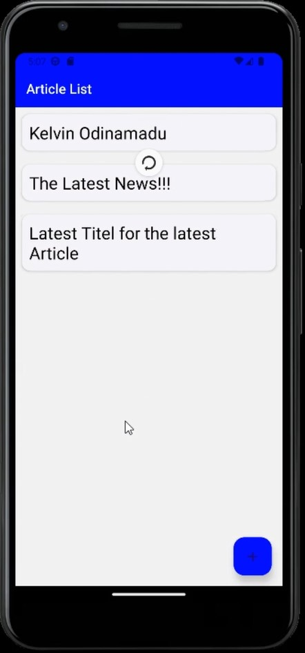
  

  <video width="400" height="300" style="border: 1px solid black; margin: 10px;" controls>
    <source src="./images/image15.mp4" type="video/mp4">
    Your browser does not support the video tag.
  </video>

## Lets Connect
### Connect with me on LinkedIn to stay up-to-date on the latest developments and new features: https://www.linkedin.com/in/kelvin-odi/